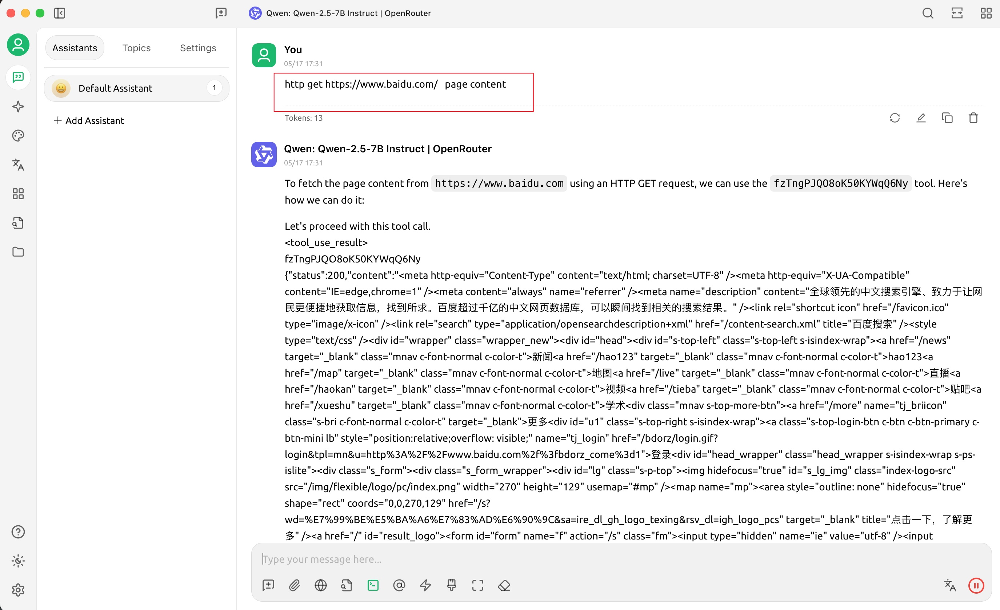

# MCP Http Server

## 📋 Project Overview

MCP Http Server is a Model Context Protocol (MCP) server implemented based on the Python httpx library. It supports HTTP request operations via a REST API, including various methods like GET, POST, PUT, and DELETE, aiming to simplify integration with various Web APIs.

<!-- Figure 1: MCP Http Server Overview -->

<!-- Figure 2: MCP Http Server Tool Example -->

## 🚀 Quick Start

### Dependencies

- Python 3.x
- [httpx](https://www.python-httpx.org/) library
- [uv](https://github.com/astral-sh/uv) (recommended package manager)

### Installation and Startup

#### Clone the project

```bash
git clone https://github.com/one-matrix/mcp-http.git
cd mcp-http
```
> Please replace `one-matrix` with the actual username or project URL.

#### Install dependencies

Using uv (recommended):

```bash
uv pip install .
```

Or using pip:

```bash
pip install .
```

#### Start the server

> Please add the actual startup command in your project, e.g., `python server.py` or `uv run server.py`.

## 🛠️ Available Tools

This service provides the following core tools for Web API interaction:

### 1. `http_get`

- **Description:** Executes a GET request to the specified URL.
- **Parameters:**
  - `url` (str): The target URL, e.g., `https://api.example.com/data`.
  - `params` (dict, optional): A dictionary of URL query parameters.
- **Returns:** Status code (int) and response content (str).

### 2. `http_post`

- **Description:** Executes a POST request to the specified URL, optionally with a data body.
- **Parameters:**
  - `url` (str): The target URL.
  - `params` (dict, optional): A dictionary of URL query parameters.
  - `body` (dict, optional): A dictionary for the JSON request body.
  - `headers` (dict, optional): Request headers. Defaults to include `Content-Type: application/json`.
- **Returns:** Status code (int) and response content (str).

### 3. `http_put`

- **Description:** Executes a PUT request to the specified URL, optionally with a data body.
- **Parameters:**
  - `url` (str): The target URL.
  - `params` (dict, optional): A dictionary of URL query parameters.
  - `body` (dict, optional): A dictionary for the JSON request body.
  - `headers` (dict, optional): Request headers. Defaults to include `Content-Type: application/json`.
- **Returns:** Status code (int) and response content (str).

### 4. `http_delete`

- **Description:** Executes a DELETE request to the specified URL.
- **Parameters:**
  - `url` (str): The target URL.
  - `params` (dict, optional): A dictionary of URL query parameters.
- **Returns:** Status code (int) and response content (str).

> The original document described this as a "status code string"; typically, the status code is an integer, and the response content might be empty or a simple confirmation message. This has been adjusted for consistency.

## 🤝 Integration with Claude Desktop

You can integrate this MCP Http Server with Claude Desktop.

### Method 1: Using uv to start

Add the following configuration to your `claude_desktop_config.json` file:

```json
{
  "mcpServers": {
    "mcp-httpx": {
      "command": "uv",
      "args": [
        "--from",
        "git+https://github.com/one-matrix/mcp-http", 
        "run",
        "mcp-http"
      ]
    }
  }
}
```
```json
{
  "mcpServers": {
    "mcp-httpx": {
      "command": "uvx",
      "args": [
        "--from",
        "git+https://github.com/one-matrix/mcp-http", 
        "mcp-http" 
      ]
    }
  }
}
```

or you can install :  uv pip install mcp-http

```json
{
  "mcpServers": {
    "mcp-httpx": {
      "command": "uv",
      "args": [
        "run",
        "-m",
        "mcp_http"
      ]
    }
  }
}
```


## Example


## 📜 License

This project is open-sourced under the MIT License. You are free to use, modify, and distribute this software. For specific terms, please refer to the LICENSE file in the project repository.